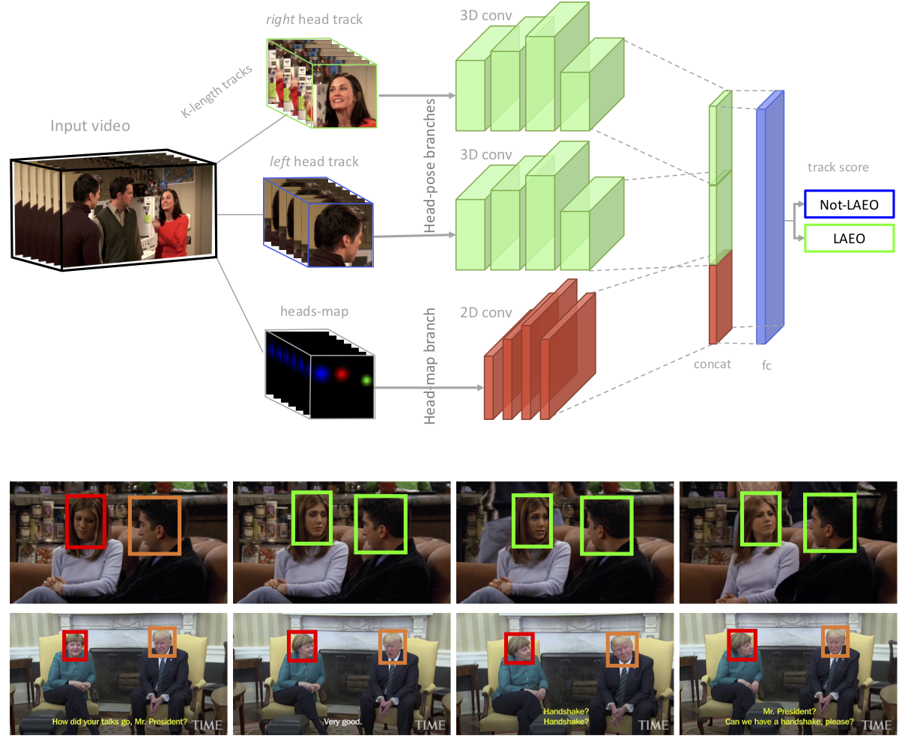

# LAEO-Net

Support code for [LAEO-Net paper](http://openaccess.thecvf.com/content_CVPR_2019/papers/Marin-Jimenez_LAEO-Net_Revisiting_People_Looking_at_Each_Other_in_Videos_CVPR_2019_paper.pdf) (CVPR'2019).

<div align="center">
    
</div>
The LAEO-Net receives as input two tracks of head crops and a map containing the relative position of the heads, and returns the probability of being LAEO those two heads.

### Quick start

The following demo predicts the LAEO label on a pair of heads included in 
subdirectory `data/ava_val_crop`. You can choose either to use a model trained on UCO-LAEO 
or a model trained on AVA-LAEO.   

```python
cd laeonet
python mains/ln_demo_test.py
```

*Training code will be available soon.*

### Install

The saved models require a specific version of libraries to be loaded properly. See the [LAEO-Net Wiki](https://github.com/AVAuco/laeonet/wiki) for details. 
For example, it is known not to work with versions of Python greater than 3.5.x.

### References
```
@inproceedings{marin19cvpr,
  author    = {Mar\'in-Jim\'enez, Manuel J. and Kalogeiton, Vicky and Medina-Su\'arez, Pablo and and Zisserman, Andrew},
  title     = {{LAEO-Net}: revisiting people {Looking At Each Other} in videos},
  booktitle = CVPR,
  year      = {2019}
}
```
